# BobForge Backend Architecture Diagrams

## System Overview

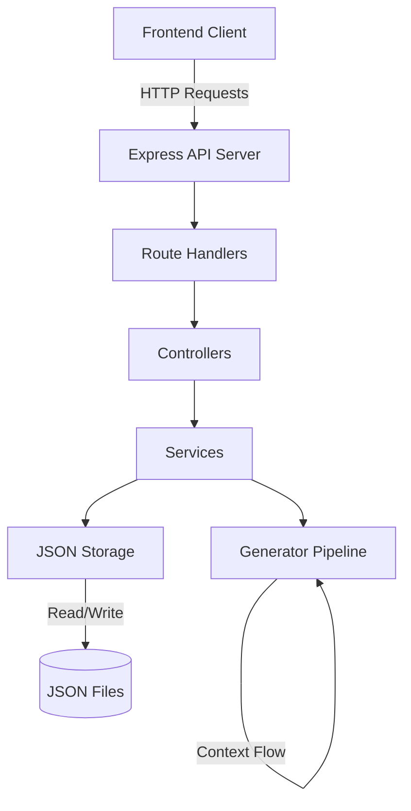

## Request Flow - Blueprint Generation

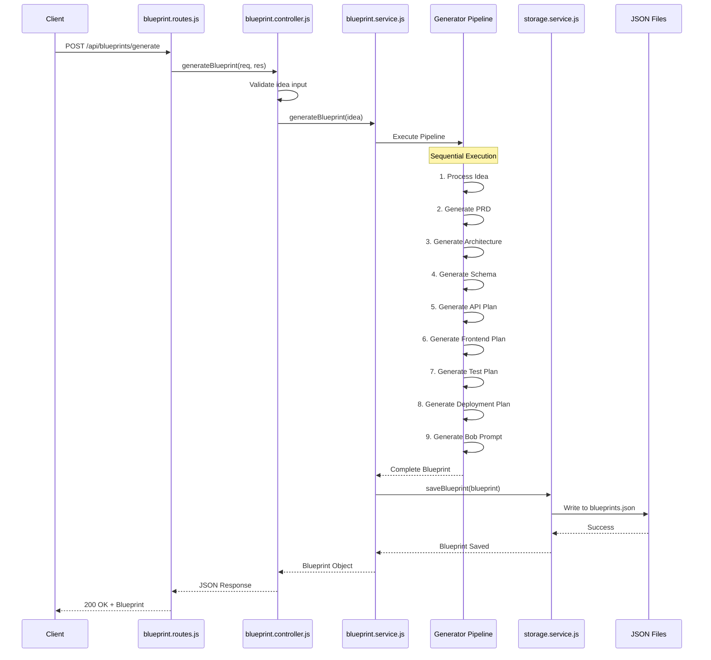

## Generator Pipeline Architecture

```mermaid
graph LR
    Input[Idea Input]
    
    Input --> PRD[PRD Generator]
    PRD --> Arch[Architecture Generator]
    Arch --> Schema[Schema Generator]
    Schema --> API[API Plan Generator]
    API --> Frontend[Frontend Plan Generator]
    Frontend --> Tests[Test Plan Generator]
    Tests --> Deploy[Deployment Plan Generator]
    Deploy --> Bob[Bob Prompt Generator]
    Bob --> Output[Complete Blueprint]
    
    style Input fill:#e1f5ff
    style Output fill:#c8e6c9
    style PRD fill:#fff9c4
    style Arch fill:#fff9c4
    style Schema fill:#fff9c4
    style API fill:#fff9c4
    style Frontend fill:#fff9c4
    style Tests fill:#fff9c4
    style Deploy fill:#fff9c4
    style Bob fill:#fff9c4
```

## Context Object Flow

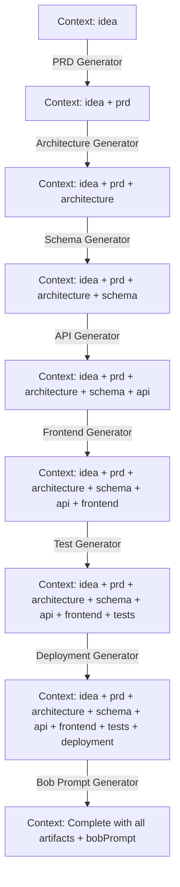

## File System Structure

```mermaid
graph TD
    Root[backend/]
    
    Root --> Src[src/]
    Root --> Package[package.json]
    Root --> Env[.env.example]
    Root --> Git[.gitignore]
    Root --> Readme[README.md]
    
    Src --> Server[server.js]
    Src --> App[app.js]
    Src --> Routes[routes/]
    Src --> Controllers[controllers/]
    Src --> Services[services/]
    Src --> Generators[generators/]
    Src --> Utils[utils/]
    Src --> Data[data/]
    
    Routes --> R1[health.routes.js]
    Routes --> R2[blueprint.routes.js]
    Routes --> R3[artifact.routes.js]
    
    Controllers --> C1[blueprint.controller.js]
    Controllers --> C2[artifact.controller.js]
    
    Services --> S1[storage.service.js]
    Services --> S2[blueprint.service.js]
    Services --> S3[artifact.service.js]
    
    Generators --> G1[prdGenerator.js]
    Generators --> G2[architectureGenerator.js]
    Generators --> G3[schemaGenerator.js]
    Generators --> G4[apiPlanGenerator.js]
    Generators --> G5[frontendPlanGenerator.js]
    Generators --> G6[testPlanGenerator.js]
    Generators --> G7[deploymentPlanGenerator.js]
    Generators --> G8[bobPromptGenerator.js]
    
    Utils --> U1[slugify.js]
    Utils --> U2[validators.js]
    
    Data --> D1[blueprints.json]
    Data --> D2[artifacts.json]
```

## API Endpoint Structure

```mermaid
graph LR
    API[Express API]
    
    API --> Health[/api/health]
    API --> Blueprints[/api/blueprints]
    API --> Artifacts[/api/artifacts]
    
    Blueprints --> BP1[POST /generate]
    Blueprints --> BP2[GET /]
    Blueprints --> BP3[GET /:id]
    Blueprints --> BP4[GET /:id/export/markdown]
    
    Artifacts --> A1[POST /]
    Artifacts --> A2[GET /]
    Artifacts --> A3[GET /:id]
    
    Health --> H1[GET /]
```

## Data Model Relationships

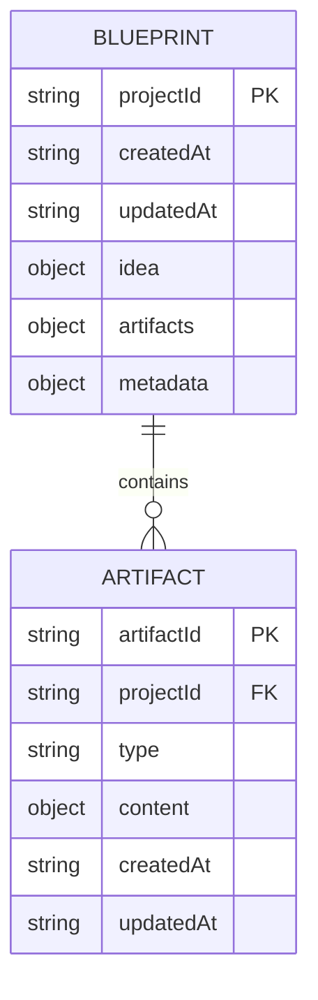

## Error Handling Flow

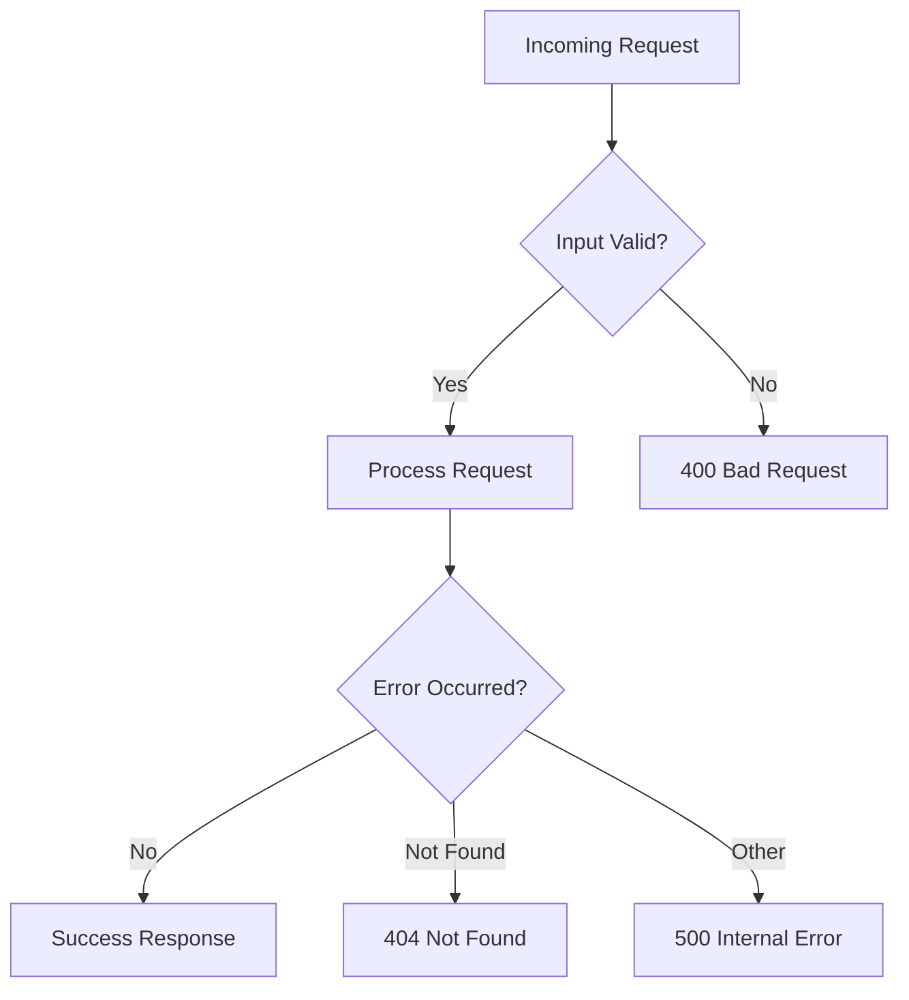

## Middleware Stack

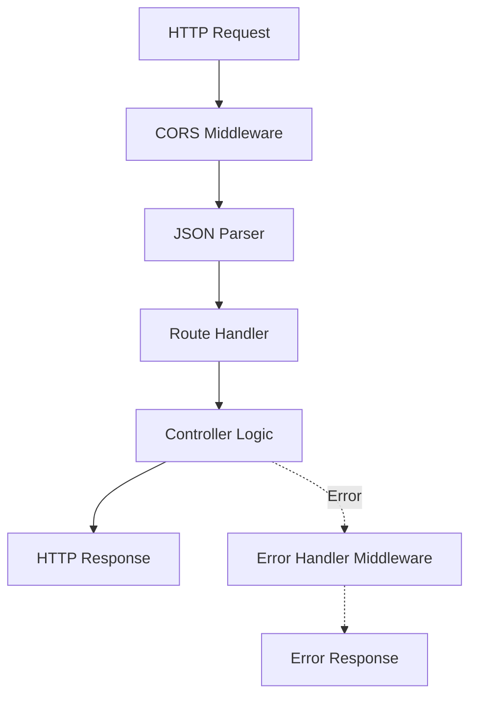

## Storage Service Operations

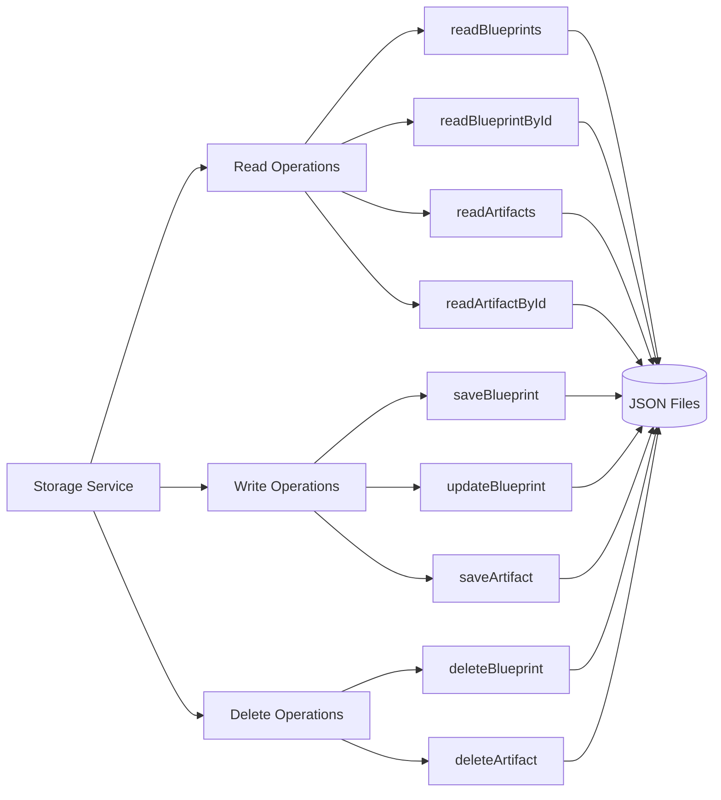

## Generator Module Pattern

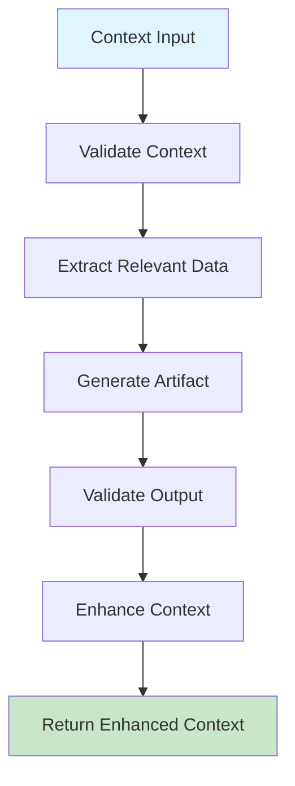

## Deployment Architecture

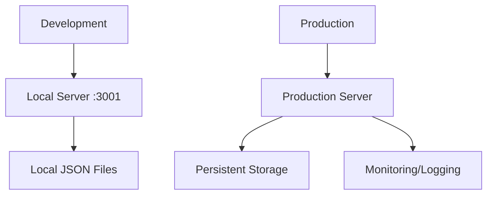

## Security Layers

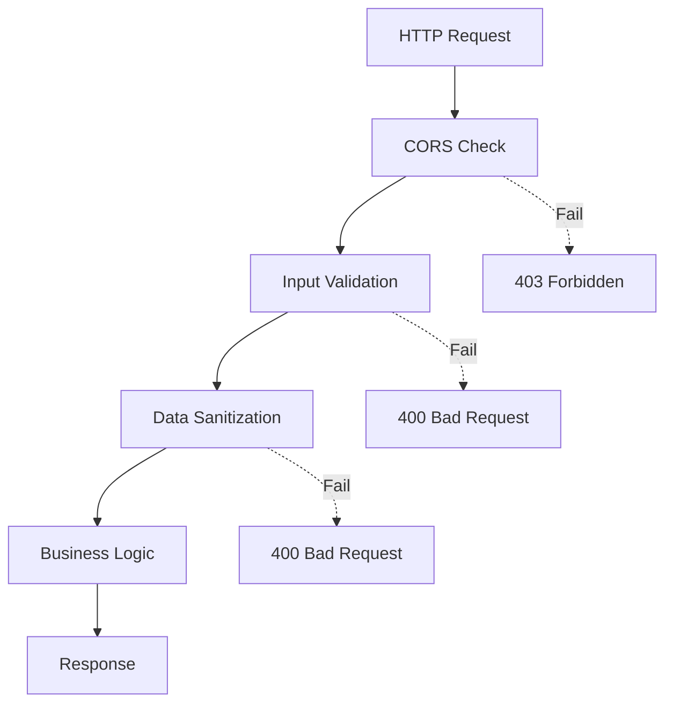

## Testing Strategy

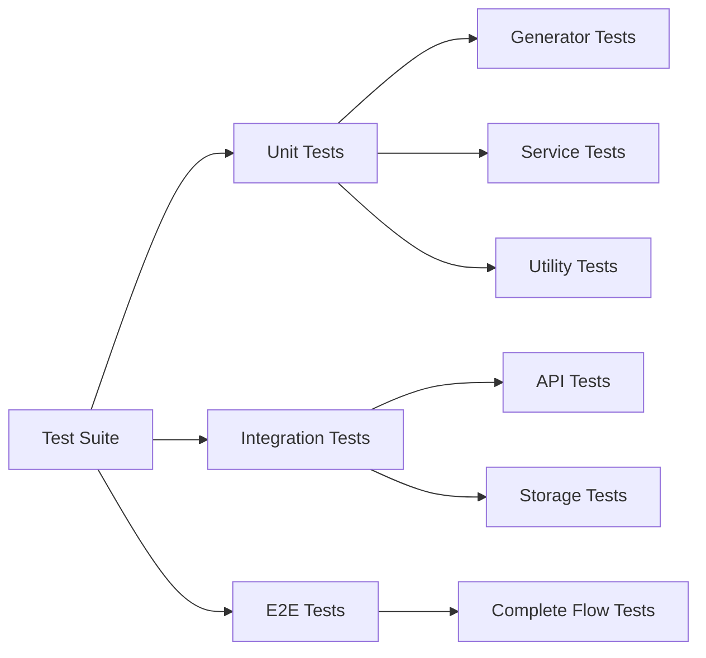

## IBM Bob Integration Points

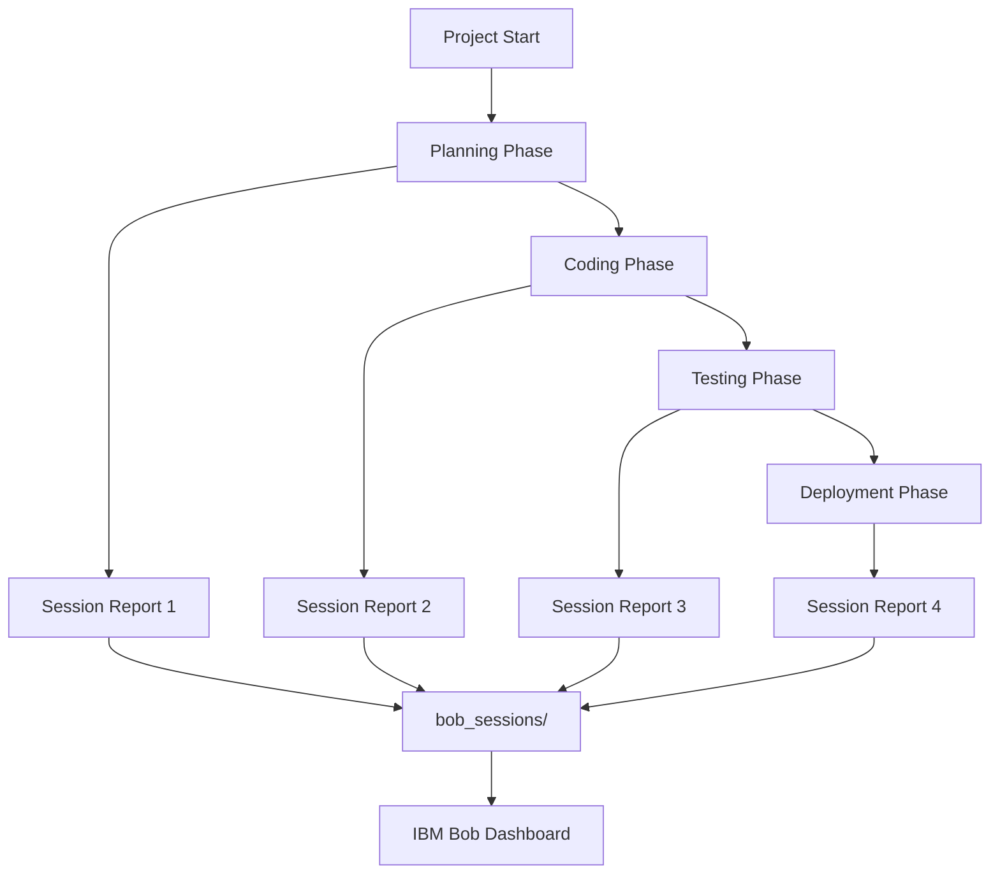

## Performance Optimization Strategy

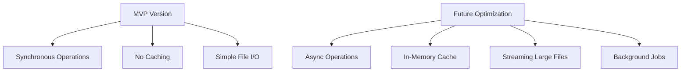
